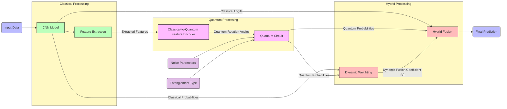

# QShield: Securing Neural Networks Against Adversarial Attacks Using Quantum Circuits


[](#)
[](#)
[](#)
[](#)
[](#)
[](#)


## 📚 Table of Contents

1. [📋 Overview](#-overview)
2. [💡 Key Features](#-key-features)
3. [🏗️ Architecture & Components](#%EF%B8%8F-architecture--components)
4. [🛢️ Datasets](#%EF%B8%8F-datasets)
5. [🧠 Models](#-models)
6. [⚙️ Installation & Setup](#%EF%B8%8F-installation--setup)
7. [🗂️ Code Structure](#%EF%B8%8F-code-structure)
8. [📦 Libraries & Dependencies](#-libraries--dependencies)
9. [📑 Citation](#-citation)
10. [📜 License](#-license)


## 📋 Overview

In this work, we present QShield, a quanvolutional neural network architecture designed to enhance the adversarial robustness of classical neural networks. QShield combines a convolutional neural network (CNN) backbone for feature extraction with a quantum module that encodes features into quantum states, applies entanglement patterns under realistic noise conditions, and outputs a hybrid prediction via a dynamic fusion coefficient. We evaluate classical and our quanvolutional neural network on MNIST, OrganAMNIST, and CIFAR-10 using several robustness, efficiency, and computational metrics.

Our results reveal that classical models are highly vulnerable to adversarial attacks, whereas our quanvolutional neural network with entanglement patterns maintains high accuracy and substantially reduces attack success rates for various adversarial attack methods. Across all of the datasets, our quanvolutional neural network consistently outperformed CNN baseline, with robustness improvements ranging from modest improvements on gradient-based attacks to more than an order of magnitude on optimization- and query-based attacks. Moreover, QShieled significantly increased the computational cost of generating adversarial examples, introducing an additional layer of defense.

These findings indicate that our architecture achieves a practical balance between accuracy, robustness, and adversarial attack inefficiency, positioning it as a promising solution for secure and reliable machine learning in sensitive and safety-critical applications.


## 💡 Key Features

* **Device-Aware Training**: Automatic CUDA/CPU detection and device placement.
* **Jupyter Notebook Integration**: Ready-to-run training/evaluation pipelines with logging, dataset selection, and attack configuration.
* **Configurable Settings**: Easy parameterization of entanglement depth, encoding strategy, noise strength, number of classes, and optimizer/loss.
* **QShield Architecture**: Novel hybrid quantum–classical pipeline combining CNN feature extraction with parameterized quantum circuits.
* **Robustness Evaluation**: Benchmarked under diverse adversarial attacks (FGSM, PGD, DeepFool, C&W, Square, etc.) across datasets (MNIST, CIFAR10, OrganAMNIST).
* **Entangled Quanvolutional Layers**: Support for multiple entanglement patterns: none, linear, star, fully-connected.
* **Adaptive Hybrid Fusion**: Dynamic fusion mechanism (MLP-based) that adaptively balances quantum and classical predictions per input.
* **Noise Modeling**: Built-in simulation of quantum noise (depolarizing, amplitude damping, phase damping, mixed) and optional input noise injection.
* **Flexible Encoding Methods**: Supports both basic angle encoding and enhanced angle encoding (multi-gate RX/RY/RZ with PCA/orthogonal expansion for dimensionality handling).


## 🏗️ Architecture & Components




## 🛢️ Datasets

QShield experiments are evaluated on widely used benchmark datasets for both general-purpose and medical imaging tasks:

* **📝 [MNIST](https://pytorch.org/vision/main/generated/torchvision.datasets.MNIST.html)** 
  Handwritten digit classification dataset containing 70,000 grayscale images (28×28) across 10 classes (digits 0–9).

* **🖼️ [CIFAR-10](https://pytorch.org/vision/main/generated/torchvision.datasets.CIFAR10.html)**
  Natural image dataset with 60,000 color images (32×32) across 10 object classes (airplane, car, cat, dog, etc.).

* **🫀 [OrganAMNIST](https://medmnist.com/)**
  A medical imaging benchmark derived from abdominal CT scans, containing 11 organ classes for classification.

All datasets used in QShield can also be accessed directly via the following Hugging Face repository:

🔗 [QShield Datasets on Hugging Face](https://huggingface.co/datasets/QShield-hf/Dataset/tree/main)


## 🧠 Models

The trained DNN, CNN, and QNN models are publicly available and can be accessed via the following Hugging Face link:

🔗 [QShield Models on Hugging Face](https://huggingface.co/QShield-hf/Model/tree/main)


## ⚙️ Installation & Setup

#### 1. Environment Setup
```bash
#🔹Create a virtual environment (recommended)
python -m venv qshield

#🔹Activate the environment

# On Linux/macOS:
source qshield/bin/activate

# On Windows:
qshield\Scripts\activate

# If using Conda:
conda activate qshield
```
```
# Install dependencies
pip install -r requirements.txt
```


#### 2. Parameters Configuration

This section lists the key options and parameters you can configure before training and evaluation.


##### Device Selection

```python
global device
device = 'cuda' if torch.cuda.is_available() else 'cpu'
```

##### Model & Dataset Settings

```python
# Choose the quantum circuit pattern:
# Options: no_entanglement_ansatz, linear_entanglement_ansatz, full_entanglement_ansatz, star_entanglement_ansatz
global entanglement_type
entanglement_type = 'no_entanglement_ansatz'

# Choose the dataset:
# Options: MNIST, CIFAR10, OrganAMNIST
global dataset_name
dataset_name = 'OrganAMNIST'

# Choose the base neural network:
# Options: CNN-MNIST, DNN-MNIST, CNN-CIFAR10, DNN-CIFAR10, CNN-OrganAMNIST, DNN-OrganAMNIST
global NN_name
NN_name = 'DNN-OrganAMNIST'
```


##### Adversarial Attack Settings

```python
# Adversarial attack method:
# Options: fgsm_attack, pgd_attack, apgd_attack, vnifgsm_attack, vmifgsm_attack, 
#          sinifgsm_attack, cw_attack, deepfool_attack, onepixel_attack, square_attack
global adversarial_attack_name
adversarial_attack_name = 'fgsm_attack'
```


##### Training Parameters

```python
# Number of training epochs
global num_epochs
num_epochs = 10

# Number of classes:
# 10 → MNIST / CIFAR10
# 11 → OrganAMNIST
global NUM_CLASSES
NUM_CLASSES = 11
```


##### Quantum Neural Network (QNN) Settings

```python
# Enable / disable QNN model construction
global construct_qnn_model
construct_qnn_model = True

# QNN configuration
qnn_settings = {
    "output_dim": NUM_CLASSES,                       # Number of output classes
    "circuit_depth": 1,                              # Depth of the quantum circuit
    "noise_strength": 0.005,                         # Initial quantum noise strength (0.0 – 1.0)
    "input_noise_injection": False,                  # Apply random perturbations to inputs
    "entanglement_type": 'no_entanglement_ansatz',   # Entanglement type for the circuit
    "use_dynamic_weights": True,                     # Dynamic weighting for hybrid fusion
    "encoding_method": 'enhanced_angle',             # Data encoding method: 'angle' or 'enhanced_angle'
    "noise_model": 'mixed'                           # Noise model: 'depolarizing', 'amplitude_damping',
                                                     #              'phase_damping', or 'mixed'
}
```


##### Target Model, Optimizer & Loss

```python
# Select the target model:
# Options: dnn_model, cnn_model, qnn_model
global target_model
target_model = dnn_model

# Optimizer
optimizer = optim.Adam(target_model.parameters())

# Loss function
loss_fn = nn.NLLLoss()
```


## 🗂️ Code Structure

```
📁 QShield/
├── 🧠 clean_models/                                             # Models
│   └── clean_model-<dataset>-<model_type>.pt
│   └── ...
├── 🛢️ data/                                                     # Datasets
│   └── CIFAR10/
│   └── MNIST/
│   └── OrganAMNIST/
├── 📚 docs/                                                     # Documentations
│   └── Adversarial Attack Parameters.md
│   └── Dataset Visualization.ipynb
│   └── Results.ipynb
├── ➕ etc/                                                      # Integrated Jupyter Notebooks
│   └── Jupyter Notebook - Adversarial Attacks.ipynb
│   └── Jupyter Notebook - Model Training & Evaluation.ipynb
├── 📓 Jupyter Notebook.ipynb                                    # Primary Jupyter Notebook
├── 🌀 noise_transforms.py                                       # Optional Noise Transforms
├── ⚛️ qnn_toolkit.py                                            # Quanvolutional Neural Network Toolkit
├── 📦 requirements.txt                                          # Project Dependencies
└── 📖 README.md                                                 # Primary Documentation
```


## 📦 Libraries & Dependencies

|  Package |  Purpose |
|---------|---------|
| `🔥 torch` | Core deep learning framework (GPU-enabled, PyTorch 2.5.1 + CUDA 12.1) |
| `🖼️ torchvision` | Computer vision utilities, datasets, and transforms |
| `📊 matplotlib` | Visualization and plotting of results |
| `📦 medmnist` | Access to MedMNIST benchmark medical image datasets |
| `🔢 numpy` | Fundamental numerical computing library |
| `📐 scipy` | Scientific computing and optimization tools |
| `🖌 pillow` | Image processing (loading, saving, and transforming images) |
| `🎯 scikit-learn` | Machine learning utilities for metrics, preprocessing, and models |
| `⏳ tqdm` | Progress bars for loops and training |
| `🖥 psutil` | System and resource monitoring (CPU/GPU/memory usage) |
| `🛡️ torchattacks` | PyTorch-based adversarial attack implementations |
| `🛡️ adversarial-robustness-toolbox` | Advanced adversarial attacks and defenses (ART) |
| `⚛️ pennylane` | Quantum machine learning and hybrid quantum-classical circuits |
| `📋 tabulate` | Pretty-print tabular results (ODR, ASR, etc.) |
| `⚙️ pip / setuptools / wheel` | Python packaging and dependency management |


## 📑 Citation
If this repository’s code, data, or results contribute to your research, please acknowledge our work by citing the following paper:

```
@INPROCEEDINGS{CitationKey,
  author    = {},
  title     = {},
  booktitle = {},
  year      = {},
  pages     = {},
  doi       = {}
}
```


## 📜 License

This software is licensed under the GNU General Public License v3.0 (GPLv3). You are free to use, modify, and distribute this software for both personal and commercial purposes, as long as you comply with the terms of the GPLv3 license. This includes preserving the license notice and making the source code of any derivative works available under the same license.


